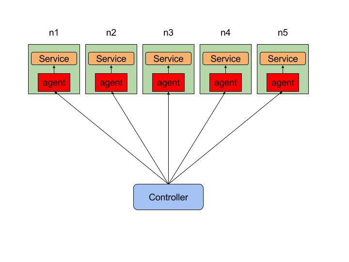

# Chaos

Chaos is used to check the distributed system linearizability.

Chaos is inspired by [jepsen](https://github.com/jepsen-io/jepsen) and uses [porcupine](https://github.com/anishathalye/porcupine) as its linearizability checker.

## Architecture

Chaos runs your registered database on 5 nodes, and starts an agent in every node too. The agent will
receive the command sent from the controller to control the service, like starting/stoping the service, 
or using a nemesis to disturb the whole cluster.



## Usage

In one shell, we start the 5 nodes and the controller.

```
cd docker
./up.sh
```

In another shell, use `docker exec -it chaos-control bash` to enter the controller, then:

```
# build the node and your own chaos test
make

# deploy and start node agent
./scripts/deploy_node.sh
./scripts/start_node.sh

# run you own chaos like
./bin/chaos-tidb
```

## Scaffold

It is very easy to write your own chaos test. TODO...